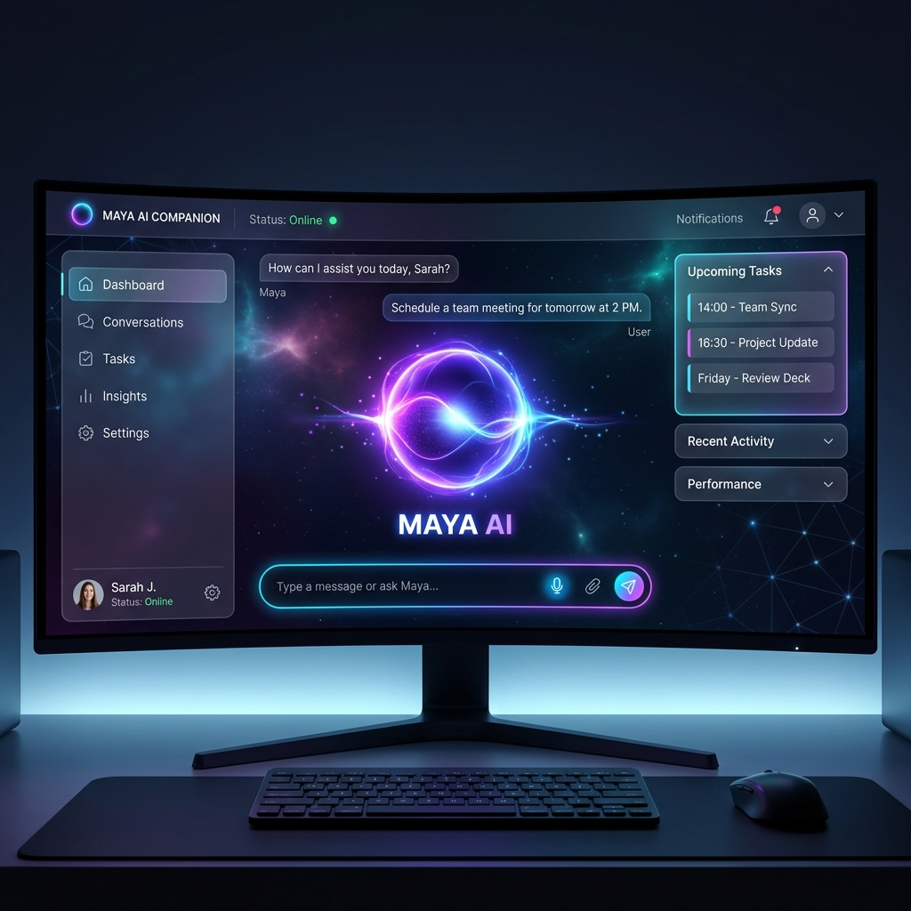

<div align="center">
  <h1>✨ Maya AI - The Next Gen Desktop Copilot</h1>
  <br/>
  
  <br/>
  <p><i>A privacy-first, fully autonomous, and highly emotional AI companion for Windows.</i></p>
  <br/>
  <a href="https://github.com/palnirupam/maya-ai">📁 GitHub Repository</a>
</div>

---

Maya is not just a chatbot—she is a **Context-Aware Desktop Agent** designed to run locally on your PC. Equipped with powerful voice cloning, hybrid vision automation, and enterprise-grade privacy controls, Maya acts as your pair programmer, assistant, and companion.

## 🌟 Key Features

### 🗣️ Immersive Voice Engine (GPT-SoVITS)
Maya doesn't sound like a robot. She is powered by a localized **GPT-SoVITS Engine**, allowing for ultra-realistic voice cloning with dynamic emotion control.
* 🎙️ **VAD Pipeline:** Uses Silero VAD + Faster Whisper to transcribe your voice perfectly.
* 🎭 **Emotion Control:** She dynamically changes her voice tone (Happy, Sad, Angry, Cute, Romantic) based on context.
* 🔄 **Smart Fallback:** If local TTS is busy, she seamlessly falls back to Microsoft Edge Neural TTS.

### 📱 Remote Mobile Control (Telegram & WhatsApp)
Maya bridges the gap between your desktop and mobile phone with native integrations.
* 🤖 **Telegram Remote Control:** Command your laptop from anywhere via a secure Telegram Bot.
  * ⚠️ **Dangerous Command Guard:** Prompts with interactive Yes/No buttons before executing risky operations like shutting down the PC.
  * 🚨 **🛑 Emergency Kill Switch:** Features a prominent, red **Emergency Stop** button at the very top of the Telegram bot keyboard! Tapping the button or sending `STOP`, `HALT`, `PANIC` instantly interrupts and kills any running orchestrator task or runaway automation in the backend, ensuring 100% host safety.
* 💬 **WhatsApp Integration:** Background headless `whatsapp-web.js` service allows Maya to send/receive messages on your behalf with automatic number verification.
* 📬 **Headless Background Emailer:** Send secure emails completely in the background via SMTP (Gmail) using AES-GCM encrypted credentials. Fully supports **file attachments** (send any PDF, image, or document from your PC remotely).
* 🔍 **Recursive PC File Search:** Locates any file on your hard drives in seconds. Highly optimized to skip heavy system/dependency folders (like `AppData`, `node_modules`, `.git`) for fast, crash-free indexing.
* ⚡ **Lightning Fast Routing:** Optimized Gemini API adapters auto-route between `gemini-3.5-flash` and `gemini-2.5-flash` for sub-3-second mobile replies.

### 👁️ Context-Aware Vision Architecture
Maya can see your screen, but **only when you ask her to**. 
* **Hybrid Automation (3-Tier Strategy):**
  1. ⚡ **Blind Macros & Shortcuts:** Lightning-fast pre-mapped hotkeys for over 60+ Windows actions (Virtual Desktops, Window Snapping, Brightness Control, Media).
  2. 🔍 **OCR-Assisted Clicking:** Maya scans the screen locally (using `EasyOCR` + `Pillow`) to find exact words and buttons. She hovers for visual confirmation before clicking!
  3. 🧠 **Gemini Vision Fallback:** Uses Gemini 1.5 Flash for deep visual reasoning.
* **App Context System:** Before working in a new app, Maya automatically reads a dedicated JSON knowledge base (`app_contexts/`) to learn the app's specific shortcuts and workflows.

### 🌐 Advanced Browser & Web Automation
Maya can natively interact with the web without manual mouse clicking.
* 🎭 **Playwright Integration:** Native `async` Playwright engine allows Maya to navigate, click, type, and extract structured data from any website programmatically.
* 🎥 **Google Meet Automation:** Automatically joins Meet calls, manages mic/camera state, and handles attendance.
* 📚 **Google Classroom Automation:** Fetches pending assignments and programmatically uploads & submits files to Classroom.
* 🎵 **Headless Ad-Free YouTube:** Play background music directly via VLC + yt-dlp without opening a browser or playing a single ad!

### 🛡️ Enterprise-Grade Privacy Controls
Spyware is creepy. Maya is transparent.
* 🚫 **Sensitive App Auto-Blocker:** If you have Bitwarden, 1Password, or a Bank tab open, Maya physically **blocks the screenshot** to protect your passwords and OTPs.
* 🔔 **Visual Overlay Feedback:** A Windows Toast Notification (`👁️ Maya is inspecting Chrome...`) pops up every single time she looks at your screen. You are always in control.

---

## ⚙️ Initial Setup

1. **API Keys Configuration**:
   Create a `.env` file in the `backend/` directory and add your keys:
   ```env
   GEMINI_API_KEY=your_gemini_api_key_here
   ELEVENLABS_API_KEY=your_elevenlabs_key_here # Optional
   ```

2. **📬 Headless Gmail Setup (No Files to Edit!)**:
   You do **not** need to open any code files or edit `.env` to set up your email! Maya is fully conversational.
   * **Step 1:** Turn on **2-Step Verification** on your Google Account, search for **App Passwords**, name it "Maya AI", and copy the generated 16-letter code.
   * **Step 2:** Simply open the **Telegram Bot on your mobile phone** (or the desktop chat interface) and tell Maya: 
     > *"Save my email as devnilasarker@gmail.com and password as ssfszsctppzaotlx"*
   * **Step 3:** Maya will automatically clean the password, encrypt the credentials securely, and save them in her local SQLite database. You're ready to send background emails! 🚀

3. **Install All Dependencies**:
   Open a terminal in the root `maya-ai` directory and run:
   ```bash
   npm run install:all
   ```
   *(This automatically creates the Python virtual environment and installs Node modules).*

## 🚀 Running the Application

Maya AI is configured to run both the frontend and backend concurrently in a single terminal.

```bash
npm start
```
*The backend will launch on `localhost:8000` and the frontend Vite dev server will open automatically.*

---

## 🛠️ Architecture Stack

### Backend (Python + FastAPI)
* **LLM Engine:** Gemini 2.5/3.5 Flash via `google-genai`
* **Multi-Agent Orchestrator:** Stateful task delegation across specialized sub-agents (Researcher, Coder, OS Executor) with safety timeouts and loop constraints
* **Voice:** Faster-Whisper, Silero VAD, GPT-SoVITS, Edge-TTS
* **Vision & Automation:** PyAutoGUI, mss, PyGetWindow, EasyOCR, RapidFuzz
* **Security:** AES-GCM Encrypted Settings, Sensitive App Keyword Blocking

### Frontend (React + Vite)
* **State Management:** Zustand
* **Audio:** WebAudio Context API (gapless queuing)
* **UI/UX:** Animated Voice Orb, Push-to-Talk, Markdown rendering

<br>
<div align="center">
  <i>Built with ❤️ for a better AI desktop experience.</i>
</div>
